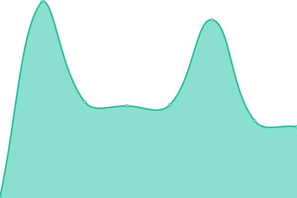
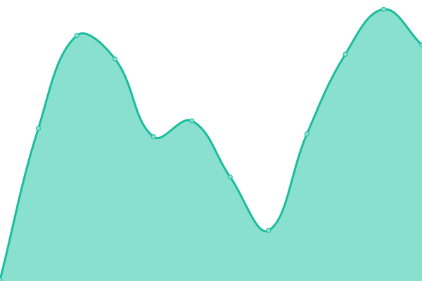
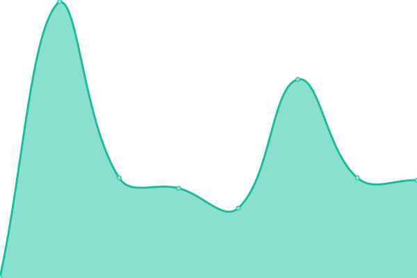
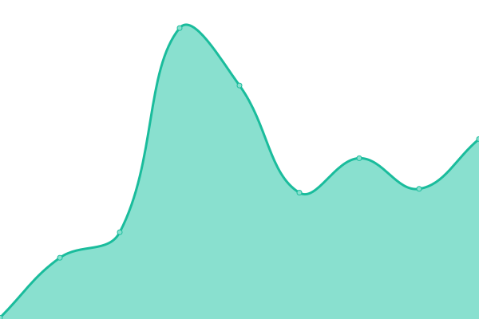

# [📈 Live Status](https://upptime.github.io/upptime): <!--live status--> **🟩 All systems operational**

This repository contains the open-source uptime monitor and status page for [Upptime](https://upptime.js.org), powered by [Upptime](https://github.com/upptime/upptime).

With [Upptime](https://upptime.js.org), you can get your own unlimited and free uptime monitor and status page, powered entirely by a GitHub repository. We use [Issues](https://github.com/upptime/upptime/issues) as incident reports, [Actions](https://github.com/MobileInsight/Navigator-uptime/actions) as uptime monitors, and [Pages](https://upptime.github.io/upptime) for the status page.

<!--start: status pages-->
<!-- This summary is generated by Upptime (https://github.com/upptime/upptime) -->
<!-- Do not edit this manually, your changes will be overwritten -->
<!-- prettier-ignore -->
| URL | Status | History | Response Time | Uptime |
| --- | ------ | ------- | ------------- | ------ |
|  [Navigator](https://navigator.trocdigital.io/ping) | 🟩 Up | [navigator.yml](https://github.com/Trocdigital/Navigator-uptime/commits/HEAD/history/navigator.yml) | 

 203ms
     
 | 

<a href="https://Trocdigital.github.io/Navigator-uptime/history/navigator">100.00%</a>
    

|  [Navigator API](https://api.trocdigital.io/ping) | 🟩 Up | [navigator-api.yml](https://github.com/Trocdigital/Navigator-uptime/commits/HEAD/history/navigator-api.yml) | 

 219ms
     
 | 

<a href="https://Trocdigital.github.io/Navigator-uptime/history/navigator-api">100.00%</a>
    

|  [Navigator Frontend Service](https://navigator.trocdigital.io/) | 🟩 Up | [navigator-frontend-service.yml](https://github.com/Trocdigital/Navigator-uptime/commits/HEAD/history/navigator-frontend-service.yml) | 

 144ms
     
 | 

<a href="https://Trocdigital.github.io/Navigator-uptime/history/navigator-frontend-service">100.00%</a>
    

|  [Navigator Monitoring](https://monitor.trocdigital.io/) | 🟩 Up | [navigator-monitoring.yml](https://github.com/Trocdigital/Navigator-uptime/commits/HEAD/history/navigator-monitoring.yml) | 

 491ms
     
 | 

<a href="https://Trocdigital.github.io/Navigator-uptime/history/navigator-monitoring">100.00%</a>
    

|  [Ticket System  Zammad Trocglobal](https://support.trocdigital.io/) | 🟩 Up | [ticket-system-zammad-trocglobal.yml](https://github.com/Trocdigital/Navigator-uptime/commits/HEAD/history/ticket-system-zammad-trocglobal.yml) | 

 222ms
     
 | 

<a href="https://Trocdigital.github.io/Navigator-uptime/history/ticket-system-zammad-trocglobal">100.00%</a>
    

|  [Ticket System  Zammad Pokemon Trocglobal](https://pokemon.tickets.trocdigital.io/) | 🟩 Up | [ticket-system-zammad-pokemon-trocglobal.yml](https://github.com/Trocdigital/Navigator-uptime/commits/HEAD/history/ticket-system-zammad-pokemon-trocglobal.yml) | 

 385ms
     
 | 

<a href="https://Trocdigital.github.io/Navigator-uptime/history/ticket-system-zammad-pokemon-trocglobal">100.00%</a>
    

|  [Troc ERP Odoo](https://troc.erp.trocdigital.io/web/login) | 🟩 Up | [troc-erp-odoo.yml](https://github.com/Trocdigital/Navigator-uptime/commits/HEAD/history/troc-erp-odoo.yml) | 

 655ms
     
 | 

<a href="https://Trocdigital.github.io/Navigator-uptime/history/troc-erp-odoo">100.00%</a>
    

|  [Ticket System  Odoo Polestar CRM](https://crm.polestarpilates.com/web/login/) | 🟩 Up | [ticket-system-odoo-polestar-crm.yml](https://github.com/Trocdigital/Navigator-uptime/commits/HEAD/history/ticket-system-odoo-polestar-crm.yml) | 

 1254ms
     
 | 

<a href="https://Trocdigital.github.io/Navigator-uptime/history/ticket-system-odoo-polestar-crm">100.00%</a>
    

|  [Navigator API AI](https://api-ai.trocdigital.io/ping) | 🟩 Up | [navigator-api-ai.yml](https://github.com/Trocdigital/Navigator-uptime/commits/HEAD/history/navigator-api-ai.yml) | 

 251ms
     
 | 

<a href="https://Trocdigital.github.io/Navigator-uptime/history/navigator-api-ai">100.00%</a>
    

|  [Zammad Apple](https://apple.tickets.trocdigital.io/) | 🟩 Up | [zammad-apple.yml](https://github.com/Trocdigital/Navigator-uptime/commits/HEAD/history/zammad-apple.yml) | 

 243ms
     
 | 

<a href="https://Trocdigital.github.io/Navigator-uptime/history/zammad-apple">100.00%</a>
    

|  [Superset Prod](https://superset.trocdigital.io/login/) | 🟩 Up | [superset-prod.yml](https://github.com/Trocdigital/Navigator-uptime/commits/HEAD/history/superset-prod.yml) | 

 539ms
     
 | 

<a href="https://Trocdigital.github.io/Navigator-uptime/history/superset-prod">100.00%</a>
    

|  [DataIntegrator API Production (Scheduler)](https://data.trocdigital.io/ping) | 🟩 Up | [data-integrator-api-production-scheduler.yml](https://github.com/Trocdigital/Navigator-uptime/commits/HEAD/history/data-integrator-api-production-scheduler.yml) | 

 219ms
     
 | 

<a href="https://Trocdigital.github.io/Navigator-uptime/history/data-integrator-api-production-scheduler">100.00%</a>
    

|  [Odoo EmployeeHub](https://employee-hub.erp.trocdigital.io/) | 🟩 Up | [odoo-employee-hub.yml](https://github.com/Trocdigital/Navigator-uptime/commits/HEAD/history/odoo-employee-hub.yml) | 

 504ms
     
 | 

<a href="https://Trocdigital.github.io/Navigator-uptime/history/odoo-employee-hub">100.00%</a>
    

|  [Odoo Roadshow](https://roadshows.erp.trocdigital.io/) | 🟩 Up | [odoo-roadshow.yml](https://github.com/Trocdigital/Navigator-uptime/commits/HEAD/history/odoo-roadshow.yml) | 

 476ms
     
 | 

<a href="https://Trocdigital.github.io/Navigator-uptime/history/odoo-roadshow">100.00%</a>
    

|  [CRM ATT Odoo](https://crm-att.erp.trocdigital.io/) | 🟩 Up | [crm-att-odoo.yml](https://github.com/Trocdigital/Navigator-uptime/commits/HEAD/history/crm-att-odoo.yml) | 

 256ms
     
 | 

<a href="https://Trocdigital.github.io/Navigator-uptime/history/crm-att-odoo">100.00%</a>
    

|  [Epson Events Odoo](https://epson-events.erp.trocdigital.io/) | 🟩 Up | [epson-events-odoo.yml](https://github.com/Trocdigital/Navigator-uptime/commits/HEAD/history/epson-events-odoo.yml) | 

 444ms
     
 | 

<a href="https://Trocdigital.github.io/Navigator-uptime/history/epson-events-odoo">100.00%</a>
    

|  [We Protec U Production (Global Leaks)](https://weprotectu.trocdigital.io/) | 🟩 Up | [we-protec-u-production-global-leaks.yml](https://github.com/Trocdigital/Navigator-uptime/commits/HEAD/history/we-protec-u-production-global-leaks.yml) | 

 144ms
     
 | 

<a href="https://Trocdigital.github.io/Navigator-uptime/history/we-protec-u-production-global-leaks">100.00%</a>
    

<!--end: status pages-->

[**Visit our status website →**](https://upptime.github.io/upptime)

## 📄 License

- Powered by: [Upptime](https://github.com/upptime/upptime)
- Code: [MIT](./LICENSE) © [Upptime](https://upptime.js.org)
- Data in the `./history` directory: [Open Database License](https://opendatacommons.org/licenses/odbl/1-0/)
